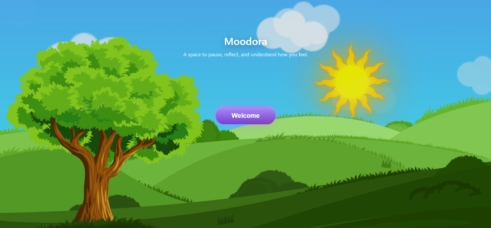
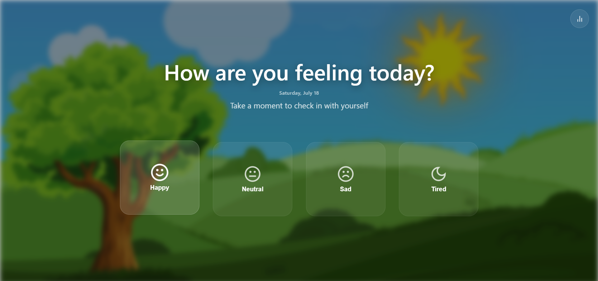
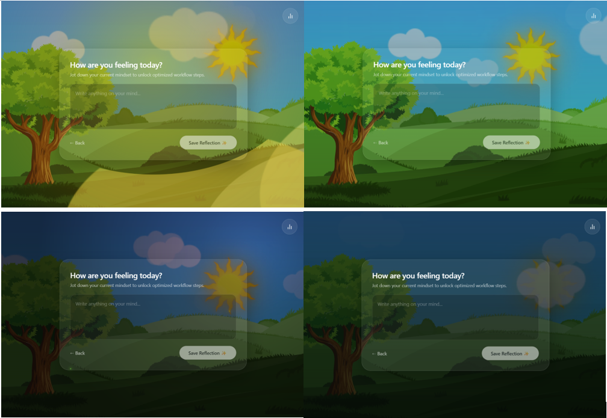

# Moodora 🌿

> A space to pause, reflect, and understand how you feel.

Moodora is a mood-aware productivity experience designed around a simple idea:

**Your environment should respond to your state of mind.**

Instead of treating productivity as the same experience for everyone, Moodora begins with a quick emotional check-in and adapts the atmosphere and suggested activities based on the user's mood.

---

## ✨ The Experience

### 1. Pause & Check In

The experience begins with a calm, distraction-free space where users can pause and check in with themselves.

### 2. Choose Your Mood

Users select how they currently feel:

- 😊 Happy
- 😐 Neutral
- 😔 Sad
- 🌙 Tired

### 3. Reflect

Users can write down what's currently on their mind before moving forward.

### 4. Adapt

Based on the selected mood, Moodora changes the surrounding environment and provides mood-aware focus suggestions.

### 5. Understand Your Patterns

Moodora stores mood history locally and provides basic analytics to help users observe their emotional patterns over time.

---

## 🌈 Environment-Aware Experience

Moodora's visual environment changes based on the selected mood, creating a different atmosphere for different emotional states.

The same space can feel different depending on how the user feels.

---

## 🧠 Core Idea

Most productivity tools ask:

> **"What do you need to do?"**

Moodora first asks:

> **"How are you feeling?"**

The idea is simple: productivity experiences should consider the user's current state of mind instead of treating every user and every moment the same.

---

## 🚀 Current Features

- Mood-based check-in
- Daily date indicator
- Reflection space
- Mood-adaptive visual environments
- Personalized focus suggestions
- Mood history stored locally
- Basic mood analytics
- Responsive interface

---

## 🛠️ Tech Stack

- React
- JavaScript
- HTML
- CSS
- LocalStorage
- Vite

---

## 📌 Project Status

Moodora is an evolving personal project.

The current version focuses on establishing the core experience:

**Check in → Reflect → Adapt → Focus**

More features and refinements are planned as the project develops.

---

## 💡 Why I Built This

I wanted to explore what happens when productivity interfaces respond not only to what a user wants to accomplish, but also to how they currently feel.

Moodora is an experiment in building a more emotionally aware and environment-driven digital experience.

